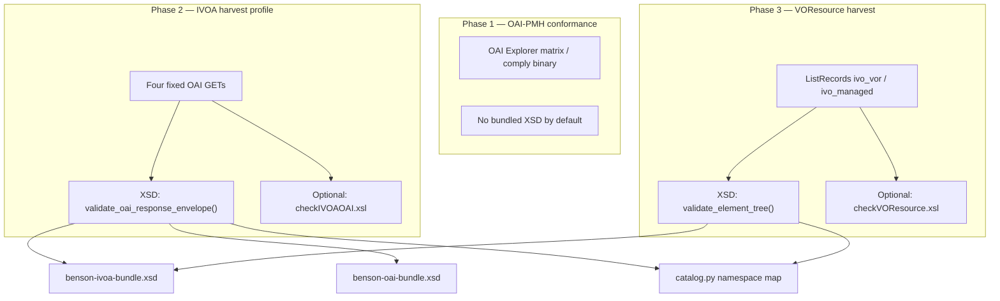

# Schemas and validation assets

This document describes the XML schema (XSD), stylesheet (XSLT), and related asset directories used by Benson’s harvest validator and OAI catalog. It is intended for developers extending validation or updating bundled IVOA/OAI artifacts.

**Runtime paths** are controlled by environment variables (defaults shown):

| Variable | Default | Role |
|----------|---------|------|
| `SCHEMA_ROOT` | `assets/schemas/` | Bundled W3C XML Schema (XSD) files |
| `ASSETS_ROOT` | `assets/validate/` | XSLT validation stylesheets |
| `STANDARDS_DIR` | `assets/standards/` | IVOA standard **records** (VOResource XML), not XSDs |
| `OAI_MANAGED_AUTHORITY` | `ivoa.net` | Authority id used when synthesizing RofR self-records |

The normative namespace-to-file mapping for harvest validation matches [regvalidate-functional-contract.md §5](regvalidate-functional-contract.md#5-namespace-to-schema-file-mapping); Benson implements that map in [`src/benson/xml/catalog.py`](../src/benson/xml/catalog.py). The contract text refers to `docs/schemas/`; in this tree the files live under **`assets/schemas/`** (same basenames).

---

## How validation uses these assets

XSD validation runs only when the client enables **built-in schemas** (`builtinSchemas` / validator checkbox “Use built-in XSD schemas”). Registration with the Registry of Registries requires this flag by default (`REGISTRATION_REQUIRE_BUILTIN_SCHEMAS`).

Implementation entry points:

| Module | Role |
|--------|------|
| [`src/benson/xml/catalog.py`](../src/benson/xml/catalog.py) | Namespace URI → local XSD filename |
| [`src/benson/xml/schema_resolver.py`](../src/benson/xml/schema_resolver.py) | Resolves `schemaLocation` imports offline; builds compiled bundle schemas |
| [`src/benson/xml/xsd_validate.py`](../src/benson/xml/xsd_validate.py) | OAI envelope + embedded payload validation; per-element VOR validation |
| [`src/benson/oai/phase2.py`](../src/benson/oai/phase2.py) | IVOA four-GET checks (XSD + XSLT) |
| [`src/benson/oai/phase3.py`](../src/benson/oai/phase3.py) | Harvested record XSD (+ XSLT) |

Standalone VOR upload validation (`POST /api/v1/registry-validate/voresource`) always uses the bundled XSD catalog, independent of the harvest `builtinSchemas` flag (per functional contract §4).

---

## `assets/schemas/` — bundled XSD files

All files in this directory are resolved **locally** via [`BundledSchemaResolver`](../src/benson/xml/schema_resolver.py). No network fetch is performed during validation.

### Bundle schemas (composition roots)

Benson does not validate most documents against a single monolithic schema. Two **bundle** files pre-import the graphs needed for common cases:

#### `benson-oai-bundle.xsd`

Imports:

- `xml.xsd` — W3C XML namespace attributes
- `simpledc20021212.xsd` — Dublin Core elements
- `oai_dc.xsd` — OAI-DC metadata format
- `OAI-v2.xsd` — OAI-PMH 2.0 response envelope

**Used when:** validating the **OAI-PMH shell** after foreign payloads under `oai:description`, `oai:metadata`, and `oai:about` have been replaced with minimal `oai_dc` stubs (see `_stub_oai_foreign_elements()` in `xsd_validate.py`). This two-step approach validates embedded IVOA metadata strictly, then checks that the overall response is a valid OAI document.

#### `benson-ivoa-bundle.xsd`

Imports the Registry Interface and VORegistry extension schemas used when `xsi:type` values such as `vg:Registry`, `vg:Authority`, or `vstd:Standard` appear on `ri:Resource`:

- `VOResource-v1.xsd`, `VORegistry-v1.xsd`, `RegistryInterface-v1.xsd`
- `VODataService-v1.xsd`, `StandardsRegExt-v1.xsd`
- Service registry extensions: `ConeSearch-v1.xsd`, `TAPRegExt-v1.xsd`, `SIA-v1.xsd`, `SSA-v1.xsd`
- VOSI: `VOSIAvailability-v1.xsd`, `VOSICapabilities-v1.xsd`, `VOSITables-v1.xsd`
- `stc-v1.xsd` — Space-Time Coordinate metadata

**Used when:** the root element namespace is `http://www.ivoa.net/xml/RegistryInterface/v1.0` (typical for `Identify` description blocks and registry interface payloads). Without this bundle, `xsi:type` extensions on `ri:Resource` would not resolve.

### Individual schema files

| File | Namespace / purpose |
|------|---------------------|
| `OAI-v2.xsd` | `http://www.openarchives.org/OAI/2.0/` — OAI-PMH 2.0 |
| `oai_dc.xsd` | `http://www.openarchives.org/OAI/2.0/oai_dc/` — OAI Dublin Core wrapper |
| `simpledc20021212.xsd` | `http://purl.org/dc/elements/1.1/` — Dublin Core elements |
| `xml.xsd` | `http://www.w3.org/XML/1998/namespace` |
| `xlink.xsd` | `http://www.w3.org/1999/xlink` |
| `OAItoolkit.xsd` | `http://oai.dlib.vt.edu/OAI/metadata/toolkit` — OAI toolkit metadata |
| `VOResource-v1.xsd` | `http://www.ivoa.net/xml/VOResource/v1.0` — core resource metadata |
| `RegistryInterface-v1.xsd` | `http://www.ivoa.net/xml/RegistryInterface/v1.0` — RI transport wrapper |
| `VORegistry-v1.xsd` | `http://www.ivoa.net/xml/VORegistry/v1.0` — registry types (`vg:*`) |
| `VODataService-v1.xsd` | `http://www.ivoa.net/xml/VODataService/v1.1` — data service types |
| `StandardsRegExt-v1.xsd` | `http://www.ivoa.net/xml/StandardsRegExt/v1.0` — standard records (`vstd:*`) |
| `ConeSearch-v1.xsd` | Cone search registry extension |
| `TAPRegExt-v1.xsd` | TAP registry extension |
| `SIA-v1.xsd` | Simple Image Access registry extension |
| `SSA-v1.xsd` | Simple Spectral Access registry extension |
| `VOSIAvailability-v1.xsd` | VOSI availability |
| `VOSICapabilities-v1.xsd` | VOSI capabilities |
| `VOSITables-v1.xsd` | VOSI tables |
| `stc-v1.xsd` | STC coordinate metadata |
| `DocRegExt-v1.0.xsd` | Document registry extension — **present in tree but not in `NAMESPACE_SCHEMA_FILES`; not used by current validation paths** |

Namespace selection for a given element (`xsd_validate._schema_for_element`):

1. `RegistryInterface` namespace → **`benson-ivoa-bundle.xsd`**
2. Any namespace listed in `catalog.py` → matching single XSD (with the same import resolver)
3. Otherwise → validation error “No bundled schema for namespace …”

---

## `assets/validate/` — XSLT rules (beyond XSD)

These stylesheets implement IVOA registry **business rules** that XSD alone does not express. They are loaded from `ASSETS_ROOT` (default this directory).

| File | Used in | Role |
|------|---------|------|
| `checkIVOAOAI.xsl` | Phase 2 | Profile tests on OAI GET responses (`Identify`, `ListMetadataFormats`, `ListSets`, `ListRecords`). Emits `<test item="RI3.1.1" …>` elements. |
| `checkVOResource.xsl` | Phase 3 | Additional constraints on harvested VOResource records. Emits `<test item="VRvalid" …>`. |
| `validationCommon.xsl` | (imported) | Shared helpers for the check stylesheets |

If XSLT processing fails or the stylesheet is missing, phase 2/3 fall back to simpler pass/fail heuristics (HTTP status and absence of OAI error codes).

**Note:** `checkIVOAOAI.xsl` references `testsVOResource-v1_0.xsl` from the legacy Java tree; that file is **not** shipped under `assets/validate/`. Import failures are caught and the code falls back to non-XSLT checks.

---

## `assets/standards/` — IVOA standard records (not XSDs)

This directory holds **VOResource XML documents** describing IVOA standards (`xsi:type="vstd:Standard"` or related). They are **catalog content**, not XML Schema definitions.

- Loaded by [`StandardsStore`](../src/benson/registry/standards_store.py)
- Exposed through Benson’s own OAI-PMH endpoint (`GET /oai`, `metadataPrefix=ivo_vor`, `set=ivo_managed`)
- Validated at load time implicitly by being well-formed RI resources; harvest validation of *remote* registries uses the XSD bundle, not these files directly

Each `*.xml` file is one standard record (identifier, title, datestamp, metadata). Example: `voresource.xml` describes the VOResource standard itself.

---

## `assets/authority/` — naming authority records

| File | Role |
|------|------|
| `ivoa.xml` | `vg:Authority` record for `ivo://ivoa.net` (IVOA naming authority) |

Used when building the Registry of Registries’ own OAI catalog ([`registry_self.py`](../src/benson/registry/registry_self.py)): the managed authority record is merged with the synthetic RofR registry record and the standards from `assets/standards/`.

This is **metadata served by Benson**, not an XSD used to validate incoming harvest traffic.

---

## Updating or extending schemas

1. **Add or replace XSD** under `assets/schemas/`. Keep `schemaLocation` imports resolvable (same directory or update [`_IMPORT_URL_TO_FILE`](../src/benson/xml/schema_resolver.py)).
2. **Register new namespaces** in [`NAMESPACE_SCHEMA_FILES`](../src/benson/xml/catalog.py) if elements appear as embedded OAI payloads or harvested records.
3. **If the namespace participates in `xsi:type` extension chains** on `ri:Resource`, add an `<xs:import>` to `benson-ivoa-bundle.xsd`.
4. **If the namespace is part of the OAI envelope or oai_dc stub path**, consider whether `benson-oai-bundle.xsd` needs an import.
5. **Clear process caches** after schema changes: bundle schemas are `@lru_cache`’d on the resolved `SCHEMA_ROOT` path (restart the server in development).
6. **Add tests** under `tests/` that exercise validation with representative XML (see `tests/test_standards_oai.py`, `tests/test_phase3_harvest.py`).

---

## Related documentation

- [regvalidate-functional-contract.md](regvalidate-functional-contract.md) — HTTP API and validation phases
- [README.md](../README.md) — run configuration and `builtinSchemas` overview
- [samples/harvest-validater/](samples/harvest-validater/) — captured validation result XML
